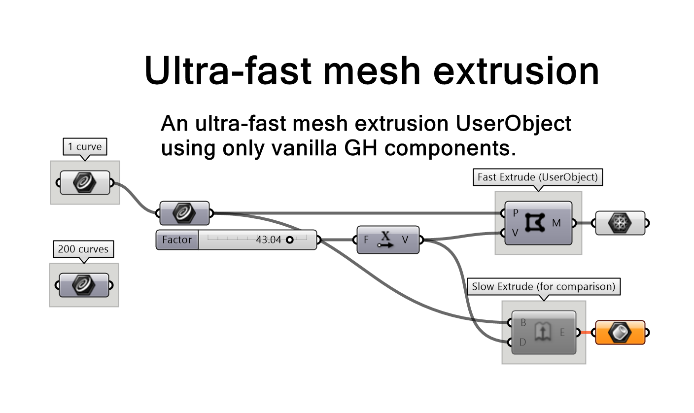

# MeshExtruder
An ultra-fast mesh extrusion UserObject using only vanilla GH components 🌟

## Context
This repository contains a lightweight and ultra-fast mesh extrusion UserObject for Grasshopper, designed to address a common need: creating a mesh visualization of beams by extruding a curve profile along a linear vector. For instance, it’s ideal for cases like extruding a wide flange section along a beam centerline.

While Grasshopper’s Extrude component can handle this task, it operates on NURBS curves and outputs breps. This approach is often unnecessarily complex and inefficient for scenarios where performance and simplicity are key. The Extrude component is relatively slow, and converting the resulting brep into a mesh adds even more processing time, often leading to meshes with excessive vertices and faces.

To solve this, I created a simple cluster that builds a mesh from scratch, optimized for speed and lightweight output. It’s not groundbreaking, but it’s practical and could save time for others facing similar challenges. If that sounds useful to you, feel free to explore and use the UserObject provided in this repository.

## The UserObject
Content of FastMeshExtrusion.ghuser

## Usage
Content of example-usage-mesh-extruder.gh. This examples compare the UserObject with the "Extrude"

## Getting started.
Download `FastMeshExtrusion.ghuser` from this repo. Drag-and-drop into your GH canvas.

## Limitations
- The profile curve must be a polyline
- The extrusion is linear only. I.e. no extrude along curves.
- The extruded mesh is not capped, meaning the result will be an open mesh

## Demo
